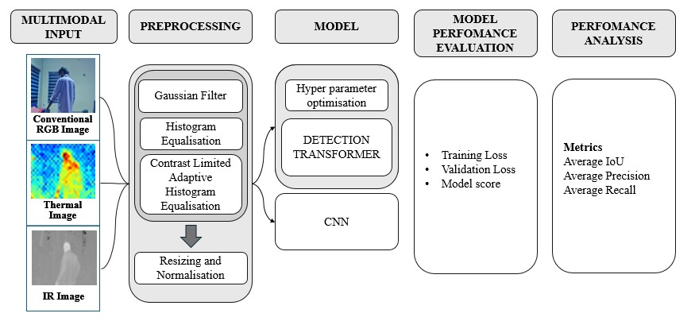
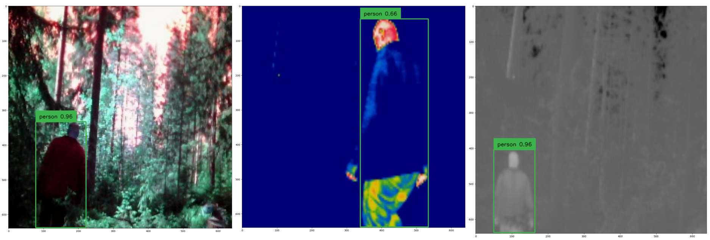

# Multimodal Human Detection System using Deep Learning Methods 🚀


## 🔍 Overview

This project presents a **Transformer-based human detection system** that integrates **RGB, Thermal, and Infrared (IR) imaging** for robust detection in diverse environmental conditions. Built using the DEtection TRansformer (DETR) model, the system improves detection accuracy in scenarios such as low-light, occlusion, and cluttered backgrounds.

### 👨‍💻 Developed By
- [**Abijith T**](https://github.com/AbijithT2003)
- [**Agney Suresh**](https://github.com/AgneySuresh)
- **Athulkrishna Dhananjayan**  
*(Under the guidance of Dr. Sreelekshmi P S, Assistant Professor, ECE Dept., NSS College of Engineering)*

## 🧠 Key Features

- 🔁 **Multimodal Input:** RGB, Thermal, and Infrared images
- ⚙️ **Advanced Preprocessing:** CLAHE, Histogram Equalization, Gaussian Filtering
- 🧭 **Object Detection with DETR:** End-to-end transformer model with self-attention
- 🔧 **Hyperparameter Tuning:** Implemented using Optuna framework
- 📊 **Model Evaluation:** mAP, IoU, GIoU, training/validation curves

## 📁 Project Structure

```
├── dataset/
│   ├── Test/
│   ├── Train/
│   └── Validation/
├── src/
│   ├── preprocessing_alternate.ipynb
│   ├── preprocessing-for-full-dataset.ipynb
│   └── DETR.ipynb
├── results/
│   ├── loss_curves/
│   └── detections/
├── notebooks/
│   └── Optuna_tuning.ipynb
├── README.md
└── requirements.txt
```
## Block Diagram

<p align="center">
  
</p>
<p align="center">
  <em>Figure 1: Block diagram for Multimodal Human Detection System.</em>
</p>

## 📷 Sample Detections

<p align="center">
  
</p>
<p align="center">
  <em>Figure 2: Detection output of RGB, Thermal and IR images by our model.</em>
</p>

## 🧰 Tech Stack

- **Language:** Python 3.10
- **Frameworks/Libraries:** PyTorch, OpenCV, Matplotlib, Optuna
- **Model Architecture:** Detection Transformer (DETR)
- **Annotation Format:** COCO

## 🧪 Results
# Model Performance Metrics

| Modality      | AP (IoU 0.50) | AP (IoU 0.75) | AR (IoU 0.75) | Training Loss |
|---------------|---------------|---------------|---------------|---------------|
| Thermal Only  | 0.782         | 0.780         | 0.836         | 0.213         |
| IR Only       | 0.769         | 0.788         | 0.856         | 0.299         |
| RGB Only      | 0.801         | 0.826         | 0.817         | 0.384         |
| **Multimodal**    | **0.891**         | **0.901**         | **0.871**         | **0.0275**        |

# Model Performance Comparison for Different Models

| Model | Modality    | AP    | AP50  | AP75  | APS   | APM   | APL   |
|-------|-------------|-------|-------|-------|-------|-------|-------|
| CNN   | RGB         | 0.865 | 0.910 | 0.835 | 0.785 | 0.860 | 0.850 |
|       | Thermal     | 0.815 | 0.870 | 0.770 | 0.735 | 0.805 | 0.820 |
|       | IR          | 0.800 | 0.850 | 0.755 | 0.710 | 0.785 | 0.810 |
|       | Multimodal  | 0.905 | 0.932 | 0.865 | 0.845 | 0.887 | 0.875 |
| DETR  | RGB         | 0.88  | 0.92  | 0.85  | 0.80  | 0.87  | 0.86  |
|       | Thermal     | 0.83  | 0.88  | 0.79  | 0.75  | 0.82  | 0.84  |
|       | IR          | 0.81  | 0.86  | 0.77  | 0.72  | 0.80  | 0.83  |
|       | Multimodal  | **0.918** | **0.945** | **0.88** | **0.86** | **0.90** | **0.89** |

# Inference from Trials with Hyperparameter Values Using Optuna

| Trial | Model Score | Learning Rate (lr)   | LR Backbone         | Weight Decay        |
|-------|-------------|----------------------|---------------------|---------------------|
| 0     | 0.6427      | \(1.20 \times 10^{-5}\) | \(6.41 \times 10^{-6}\) | \(1.17 \times 10^{-5}\) |
| 1     | 0.8745      | \(3.49 \times 10^{-4}\) | \(6.52 \times 10^{-5}\) | \(3.64 \times 10^{-5}\) |
| 2     | 0.4427      | \(6.33 \times 10^{-5}\) | \(1.35 \times 10^{-5}\) | \(4.71 \times 10^{-3}\) |
| 3     | 0.4695      | \(2.56 \times 10^{-5}\) | \(5.11 \times 10^{-6}\) | \(2.99 \times 10^{-5}\) |
| **4** | **0.4039**  | \(4.89 \times 10^{-5}\) | \(1.77 \times 10^{-5}\) | \(2.59 \times 10^{-4}\) |
| 5     | 0.4721      | \(4.63 \times 10^{-5}\) | \(9.74 \times 10^{-6}\) | \(1.68 \times 10^{-5}\) |
| 6     | 1.1940      | \(1.17 \times 10^{-5}\) | \(5.83 \times 10^{-5}\) | \(7.77 \times 10^{-5}\) |

## 📦 How To Run

```bash
open in Google Colab
connect to a gpu
run the program on Colab
```

## 📚 References

- [DETR: End-to-End Object Detection with Transformers (Facebook AI)](https://arxiv.org/abs/2005.12872)
- [Optuna Hyperparameter Optimization](https://optuna.org/)
- [Dataset 1: Human Detection Based On Infrared Images In Forestry Environments](https://archive.cs.umu.se/papers/2016-ThermalHumanDetection-AOstovar/)
- [Dataset 2: OpenThermalPose Dataset](https://github.com/Geng-J/OpenThermalPose)

## 🔗 Connect with Me

📫 [abijitht.dev@gmail.com](mailto:abijitht.dev@gmail.com)  
🔗 [LinkedIn](https://www.linkedin.com/in/abijitht/)  
📸 [Instagram](https://instagram.com/abijith_t)  
🌐 [Portfolio](https://abijitht2003.github.io/Portfolio_T/)

## 📄 License

This project is licensed under the MIT License - see the [LICENSE](LICENSE) file for details.
